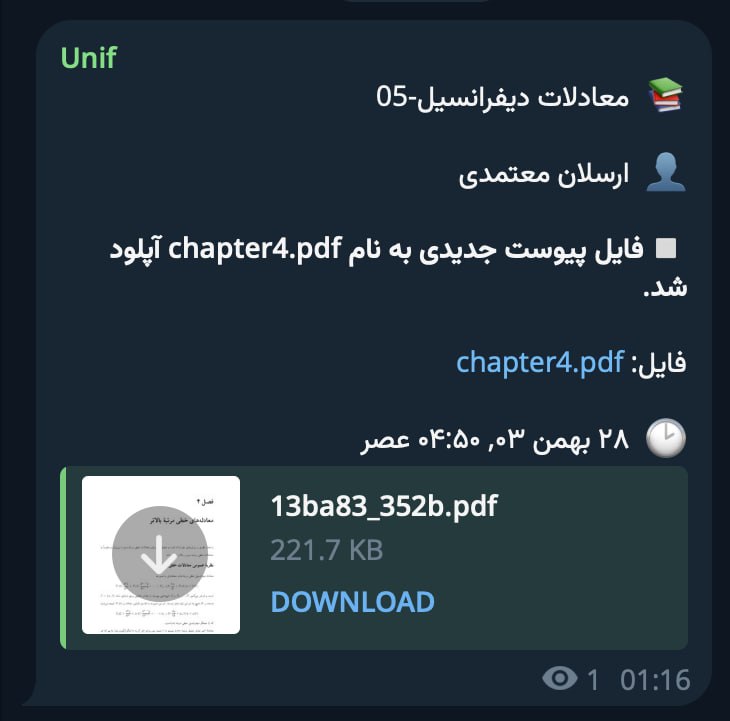

# Unif 

[](https://github.com/ausdavoud/unif/actions)
[](https://codecov.io/gh/ausdavoud/unif)
[](https://www.python.org/downloads/)
[](https://www.djangoproject.com/)
[](https://docs.celeryproject.org/)[](LICENSE.md)  

Unif is a Telegram bot that monitors and notifies users about changes in their university's Learning Management System (LMS). Stay informed about exercise deadlines, online session additions, and other critical updates without constantly checking the LMS portal. Unif bridges the gap between your academic responsibilities and your preferred communication platform.

[Click to use Unif on Telegram](https://t.me/unifgrammytestbot)

Please note that the live demo only works with [lms.ui.ac.ir](https://lms.ui.ac.ir)


<!--  -->

## Table of Contents  
- [Installation](#installation)
- [Usage](#usage)
- [Technologies Used](#technologies-used)
- [Documentation](#documentation)
- [Contributing](#contributing)
- [Contributors](#contributors)
- [License](#license)
- [Change Log](#change-log)
- [Roadmap](#roadmap)

## Installation  
Follow these steps to set up Unif locally:  

1. **Clone the repository**:  
   	```bash  
   	git clone https://github.com/ausdavoud/unif.git  
  	cd unif
	```

2. **Setup environment variables**  
	```bash
	cp .env.example .env
	```

3. **Obtain a new Telegram Bot Token from Botfather**  
	Go to [Botfather](https://t.me/BotFather) and get a bot token by creating a new bot or using an existing one.
	Set BOT_TOKEN in .env file:
	```bash
	BOT_TOKEN='7206814144:AAHuiqA7HNmRwK8vmqponfS098sTpocnTQc' # Replace this with our own token
	```
4. **Get a new Django Secret Key**  
	You can set any random string you'd like. Alternatively, generate a new one at [djecrety.ir](https://djecrety.ir/).
	Set it in .env file:
	```bash
	SECRET_KEY='44m2da+ru@b-g%^9m3kfv1_^ut9vn%5*v$cj8f!k0(_$pvagd@' # Replace this with our own secret key
	```

5. **Add your VPS IP or domain name**  
	Set `PRODUCTION_HOSTNAME` environment variable to your VPS IP address or domain (without leading http/https). It will be added to Django `ALLOWED_HOSTS` and `CSRF_TRUSTED_ORIGINS`.
	```bash
	PRODUCTION_HOSTNAME=116.125.1.53 # or your_domain.com
	```

6. **Set SSL**  
	If SSL is enabled at your specified domain (the value of `PRODUCTION_HOSTNAME`), set `SECURE_SSL_REDIRECT` to True:
	```bash
	SECURE_SSL_REDIRECT=True
	```

7. **Run the docker containers**:  
    ```bash
	docker compose up -d
   	```

Additionally, you can create a superuser for you Django admin panel. First ssh into your VPS and then:
```bash
docker compose exec web bash
. venv/bin/activate
cd src
python manage.py createsuperuser
# set user name and password
exit

```
You'll be able to visit your admin panel at `your_domain_or_IP.com/americano-coffee`. (It's also a best practice to change the admin panel url at src/core_config/urls.py)

## Usage
Send `/login` to your newly created bot and provide your LMS username and password. Unif will periodically check LMS every 5 minutes. 

## Technologies Used
- Django: Web framework for rapid development and clean design.  
- Celery: Distributed task queue for handling asynchronous jobs.  
- Redis: Message broker for Celery task management.  
- aiogram: A modern and fully asynchronous framework for Telegram Bot API 

## Documentation
View [docs](https://ausdavoud.github.io/unif).

## Contributing
We welcome contributions! To get started:

1. Fork the repository.
2. Create a feature branch: git checkout -b feature-name.
3. Commit your changes: git commit -m "Add feature".
4. Push to your branch: git push origin feature-name.
5. Submit a pull request.


## Contributors
[Davoud](https://github.com/ausdavoud)

## License
This project is licensed under the MIT License - see the [license](https://github.com/ausdavoud/UnifPython/blob/main/LICENSE) file for details.

## Change Log
1.0.0-alpha - Initial release

## Roadmap

### Authentication & User Management
- [ ] Convert bot login to service architecture
- [ ] Hash user passwords in storage
- [ ] Add `/delete_my_data` command with periodic task cleanup
- [ ] Store author_id | lmsuser mapping
- [ ] Add `/set_chat_id` command
- [x] Implement `/get_chat_id` command
- [ ] Implement notifications for unsuccessful login attempts

### Docker & Deployment
- [ ] Configure docker volumes for venv, staticfiles, and media
- [ ] Set up Dokploy integration
- [ ] Create GitHub releases workflow
- [x] Configure SSL backend

### Frontend Enhancements (HTMX)
- [ ] Chat ID management interface
- [ ] Interval configuration interface
- [ ] Active course dashboard with manual update triggers
- [ ] Account deletion interface

### Backend Improvements
- [ ] Implement change_interval API
- [ ] Migrate to Python-first approach
- [ ] Refactor atomic transactions:
  - [ ] Replace chain patterns with standard functions
  - [ ] Ensure atomic operation integrity

### Notifications & Task Processing
- [ ] Create Django admin command for batch Telegram notifications
- [ ] Develop Celery command to send pending messages (is_sent=false)
- [ ] Configure Celery retry mechanism

### Quality & Documentation
- [ ] Comprehensive logging system
- [x] Serve documentation
- [ ] Complete README documentation
- [ ] Implement test suite with coverage targets
