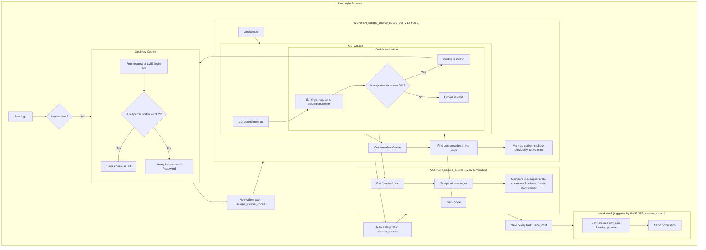

```mermaid
flowchart TD
  %% Main User Login Flow
  subgraph user_login["User Login Process"]
    A[User login] --> A1{Is user new?}
    A1 -->|Yes| get_new_cookie
    get_new_cookie --> A3[New celery task: scrape_course_codes]
    A3 --> WORKER_scrape_course_codes
    WORKER_scrape_course_codes --> A4[New celery task: scrape_course]
    A4 --> WORKER_scrape_course
    WORKER_scrape_course --> A5[New celery task: send_notif]
    A5 --> send_notif
  end

  %% Cookie Management Process
  subgraph get_new_cookie["Get New Cookie"]
    C1[Post request to LMS /login api] --> C2{Is response.status == 302?}
    C2 -->|Yes| D[Store cookie in DB]
    C2 -->|No| E[Wrong Username or Password]
  end

  %% Cookie Validation Process
  subgraph get_cookie["Get Cookie"]
    D1[Get cookie from db] --> D2[Send get request to /members/home]
    subgraph is_cookie_valid["Cookie Validation"]
      D2 --> D3{Is response.status == 302?}
      D3 -->|Yes| D4[Cookie is invalid]
      D3 -->|No| D5[Cookie is valid]
    end
    D4 --> get_new_cookie
  end

  %% Worker Processes
  subgraph WORKER_scrape_course_codes["WORKER_scrape_course_codes (every 12 hours)"]
    B1[Get cookie] --> get_cookie
    get_cookie --> B2[Get /members/home]
    B2 --> B3[Find course codes in the page]
    B3 --> B4[Mark as active, uncheck previously active ones]
  end
  
  subgraph WORKER_scrape_course["WORKER_scrape_course (every 5 minutes)"]
    E1[Get cookie] --> get_cookie
    get_cookie --> E2[Get /groups/code]
    E2 --> E3[Scrape all messages]
    E3 --> E4[Compare messages to db, create notifications, create new worker]
  end

  subgraph send_notif["send_notif (triggered by WORKER_scrape_course)"]
    F1[Get notif and env from function params] --> F2[Send notification]
  end
```